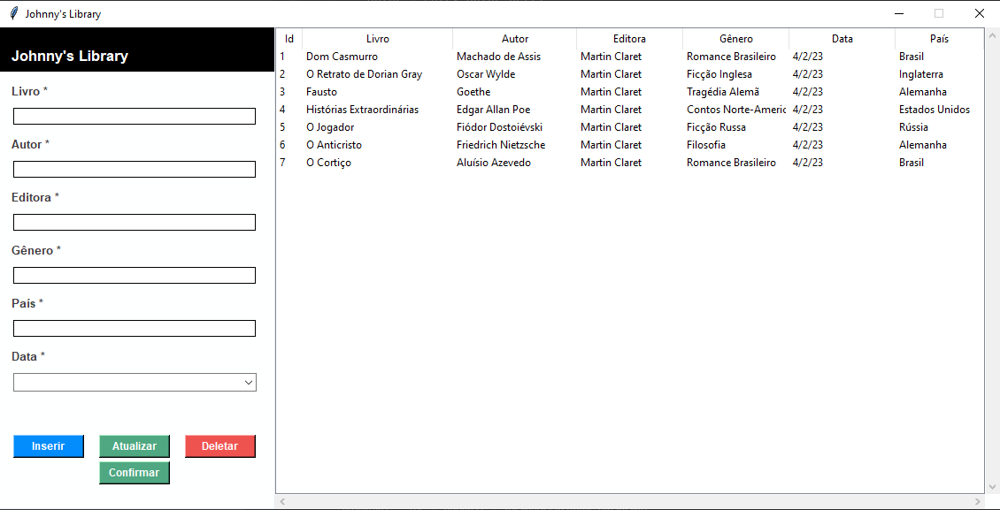

# 📚 Biblioteca CRUD in Python 📚

Este projeto foi desenvolvido seguindo a orientação do canal
["Usando Python"](https://www.youtube.com/@usandopython)

- [CRUD em Python com SQLite | Formulário Python Tkinter | parte #01](https://www.youtube.com/watch?v=7N25wyyJ7pc)
- [CRUD em Python com SQLite | Formulário Python Tkinter | parte #02](https://www.youtube.com/watch?v=bqHbY9cJZbo)
- [CRUD em Python com SQLite | Formulário Python Tkinter | parte #03](https://www.youtube.com/watch?v=2uYqJVe_0RU)
- [CRUD em Python com SQLite | Formulário Python Tkinter | parte #04](https://www.youtube.com/watch?v=4h6Nrt2AIIQ)
- [CRUD em Python com SQLite | Formulário Python Tkinter | parte #05](https://www.youtube.com/watch?v=98Hf2FAYIj4)
- [CRUD em Python com SQLite | Formulário Python Tkinter | parte #06](https://www.youtube.com/watch?v=lbhlTx2vsqI)

